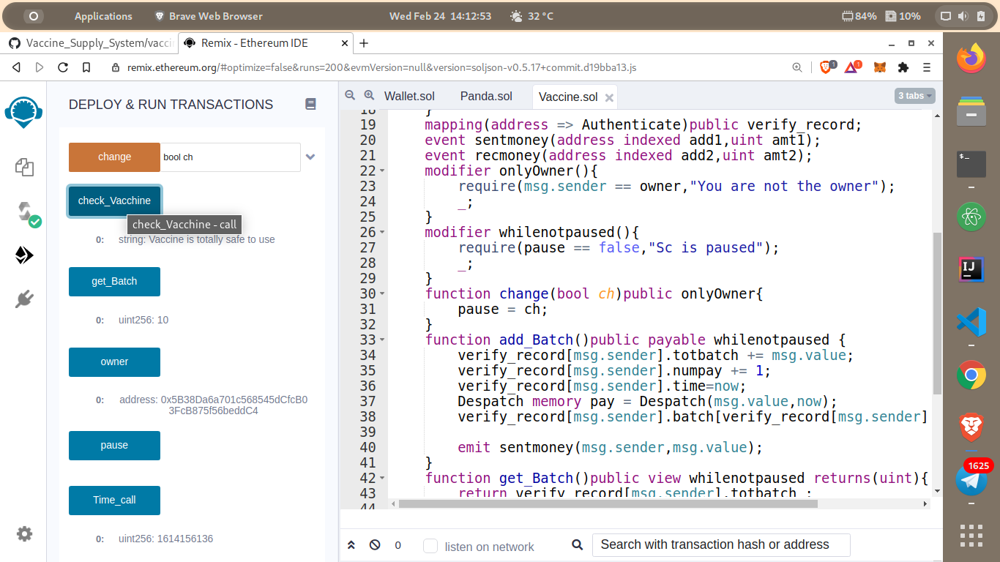
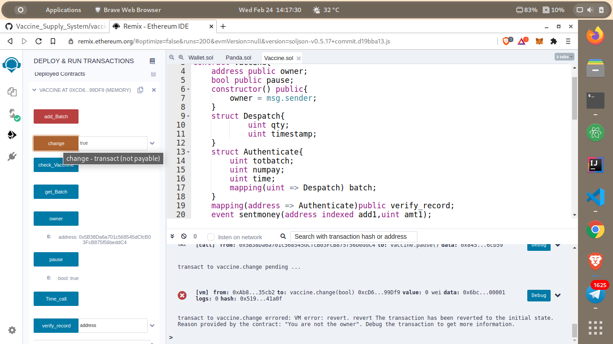

# Vaccine_Supply_System
Smart contract for vaccine supply supervision system
<h3>Metamask Account<h3>

<h3>Checking The intial Values in the smart contract<h3>  

<h3>Deploying the Vaccine Batch<h3>

<h3>Checking the block after adding Batch of Vaccine<h3>

<h3>If the Vaccine is not Expired<h3>

<h3>If the Vaccine has been Expired<h3> 

<h3>Changing the owner account to normal account<h3>

<h3>Cannot access the private details since it is not the owner account<h3>  

